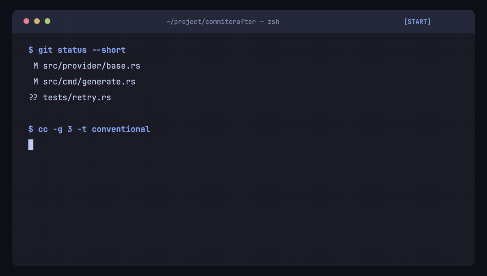

<div align="center">

# commitcrafter

**Turn a git diff into a commit message worth keeping.**

An AI-powered commit workflow with file picking, multiple candidates, an
editable preview, and local learning—all from the terminal.

[](https://github.com/Jay-0331/commet/actions/workflows/ci.yml)
[](LICENSE)



</div>

commitcrafter lets you choose the files that belong in a commit, sends only
that diff to your configured model, and gives you the final say before Git
writes anything. Use Anthropic, OpenAI, OpenRouter, or a local Ollama model.

## Features

- Interactive file picker with ignored-path indicators and staging control.
- One to five generated messages in plain, Conventional Commit, gitmoji,
  subject-plus-body, or custom formats.
- Preview, regenerate, edit in `$EDITOR`, copy, or accept without leaving the
  terminal.
- Headless modes for scripts: print, copy, or commit the first candidate.
- Global, repository, CLI, and one-shot configuration layers with source
  tracking.
- Optional local learning from accepted messages, with raw diff storage off by
  default.
- `setup`, `doctor`, `providers`, `history`, and `forget` commands for the full
  lifecycle.

## Install

### Cargo

```sh
cargo install commitcrafter
```

This installs the `cc` command. A Rust toolchain and Git are required.

### Prebuilt binaries

Download the archive for your platform from
[GitHub Releases](https://github.com/Jay-0331/commet/releases), extract it, and
move `cc` to a directory on your `PATH`. Release builds target Apple silicon
and Intel macOS plus x86-64 and ARM64 Linux.

### Homebrew

```sh
brew install jay-0331/tap/commitcrafter
```

> [!NOTE]
> The Homebrew tap is planned for v0.1 but is not published yet. Until it
> lands, use Cargo or a prebuilt release.

## Quickstart

1. Export the API key for the provider you want to use. Ollama does not need
   one.

   ```sh
   export ANTHROPIC_API_KEY="..."
   # or OPENAI_API_KEY / OPENROUTER_API_KEY
   ```

2. Run the setup wizard and verify the environment.

   ```sh
   cc setup
   cc doctor
   ```

3. Enter any Git repository with changes and run:

   ```sh
   cc
   ```

Choose files in the picker, review the generated message, then press `a` to
accept it. Press `e` to edit, `r` to regenerate, `c` to copy, or `q` to leave
without committing.

### Useful invocations

| Command | Result |
|---|---|
| `cc -g 3` | Generate three candidates. |
| `cc -t conventional` | Use Conventional Commit formatting for this run. |
| `cc -p "write in Spanish"` | Add a one-run instruction to the prompt. |
| `cc -x '*.lock'` | Exclude matching paths from model input without unstaging them. |
| `cc --all -y` | Stage tracked changes and commit the first candidate. |
| `cc --print` | Print candidates without opening the TUI or committing. |
| `cc -n` | Pass `--no-verify` to Git when the selected flow commits. |
| `cc config show` | Show the effective configuration and source of each value. |
| `cc providers` | Check provider configuration and API-key availability. |
| `cc doctor --full` | Run health checks and a small provider request. |

Run `cc --help` for the complete CLI reference.

## Configuration

The setup wizard writes the global config to:

- `$XDG_CONFIG_HOME/commet/config.toml`, when `XDG_CONFIG_HOME` is set.
- `~/.config/commet/config.toml`, otherwise.

Add `.commet.toml` at a repository root for project-specific settings. Values
are merged in this order, with later layers winning:

```text
defaults < global config < repo config < CLI flags < --set overrides
```

Use `cc config edit` to edit the repository config when inside a repo,
`cc config edit --global` for the global file, and `cc config show` to inspect
the final merge.

API keys are read from environment variables, not the TOML file.

### Anthropic

```sh
export ANTHROPIC_API_KEY="..."
```

```toml
[provider]
default = "anthropic"

[providers.anthropic]
model = "claude-sonnet-4-6"
max_tokens = 1024
temperature = 0.2
timeout_secs = 60
max_retries = 2
```

### OpenAI

```sh
export OPENAI_API_KEY="..."
```

```toml
[provider]
default = "openai"

[providers.openai]
model = "gpt-4o-mini"
max_tokens = 1024
temperature = 0.2
timeout_secs = 60
max_retries = 2
```

### OpenRouter

```sh
export OPENROUTER_API_KEY="..."
```

```toml
[provider]
default = "openrouter"

[providers.openrouter]
endpoint = "https://openrouter.ai/api/v1"
model = "anthropic/claude-sonnet-4"
max_tokens = 1024
temperature = 0.2
http_referer = ""
x_title = "commet"
timeout_secs = 60
max_retries = 2
```

### Ollama

Start Ollama with the configured model available, then use:

```toml
[provider]
default = "ollama"

[providers.ollama]
endpoint = "http://localhost:11434"
model = "llama3.1:8b"
timeout_secs = 60
max_retries = 2
```

### Message style and diff filtering

```toml
[style]
format = "conventional"
generate = 3
subject_max_len = 72
include_body = true
allowed_scopes = ["cli", "config", "provider"]
extra_prompt = "Prefer imperative subjects"

[git]
ignore_paths = ["package-lock.json", "*.lock", "dist/**"]
diff_max_bytes = 102400
```

The supported formats are `plain`, `conventional`, `conventional+body`,
`gitmoji`, `subject+body`, and `custom`. Every leaf can also be overridden for
one run, for example:

```sh
cc --set style.subject_max_len=50 --set learning.scope=off
```

## Privacy

commitcrafter sends the selected diff, filenames, and prompt instructions to
the configured provider. Paths matched by `git.ignore_paths` or `-x/--exclude`
are removed from that request but remain staged. With Ollama, requests stay on
the configured local endpoint; hosted providers apply their own data policies.

Accepted messages can be saved locally and reused as examples on later runs.
The default scope is `repo+global`, using these JSONL stores:

- Repository: `<repo>/.commet/history.jsonl`
- Global: `$XDG_STATE_HOME/commet/history.jsonl`, or
  `~/.local/state/commet/history.jsonl` when `XDG_STATE_HOME` is unset

Raw diffs are **not** stored by default. The record keeps the message,
provider/model, filenames, and diff byte count; `[learning].store_diffs` must be
explicitly set to `true` before diff content is persisted.

Disable learning completely with:

```toml
[learning]
enabled = false
scope = "off"
```

Inspect or remove local history at any time:

```sh
cc history --last 20
cc history --repo
cc forget --last
cc forget --repo
cc forget --all
```

Repository and full-store deletion ask for confirmation; add `-y` only when
you intentionally want a non-interactive deletion.

## Development

Common tasks are exposed through the [`Justfile`](Justfile). Install
[`just`](https://github.com/casey/just) with `cargo install just` or
`brew install just`, then:

| Recipe | What it does |
|---|---|
| `just build` | Build the debug binary. |
| `just build-release` | Build an optimized binary. |
| `just run -- --help` | Run the CLI with extra arguments. |
| `just test` | Run unit, integration, and doc tests with all features. |
| `just lint` | Run Clippy for all targets and deny warnings. |
| `just fmt` / `just fmt-check` | Apply or verify Rust formatting. |
| `just ci` | Run the same format, lint, and test gates as CI. |
| `just pre-push` | Format, lint, and test before pushing. |

Plain Cargo commands work as well; the Justfile is only a convenience.

## Acknowledgments

commitcrafter is built with [Ratatui](https://ratatui.rs/) and
[Crossterm](https://github.com/crossterm-rs/crossterm) for the terminal UI,
[Clap](https://github.com/clap-rs/clap) for the CLI, and the APIs provided by
Anthropic, OpenAI, OpenRouter, and Ollama. Its message formats are inspired by
[Conventional Commits](https://www.conventionalcommits.org/) and
[gitmoji](https://gitmoji.dev/).

## License

[MIT](LICENSE)
